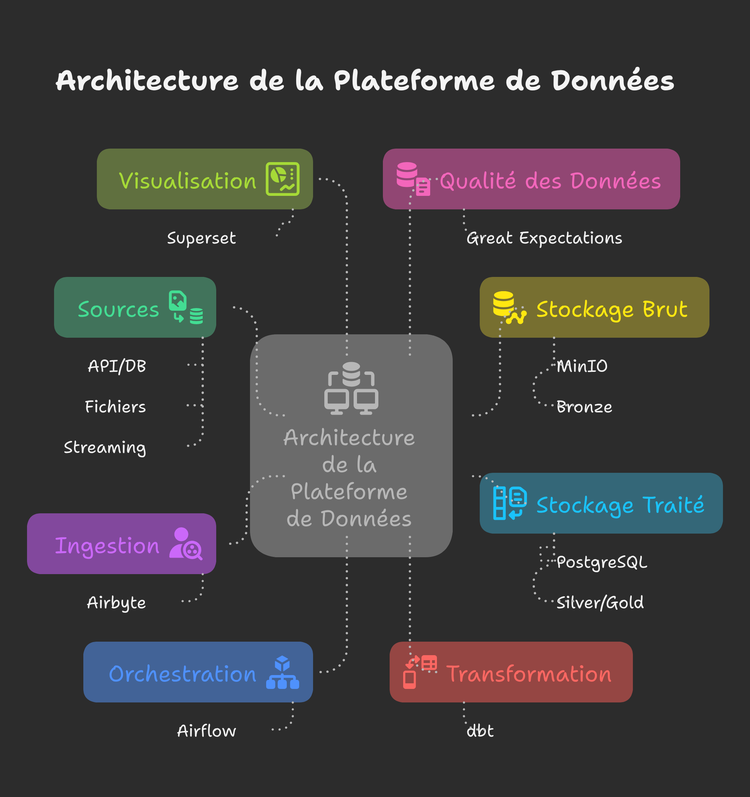

# Pulse Stack - Modern Data Platform

A comprehensive data platform using modern architecture with orchestration, ingestion, transformation, and visualization.

## 🏗️ Architecture



## 🚀 Included Services

### 📊 **PostgreSQL** - Main Database
- **Port:** 5433 (external) / 5432 (internal)
- **User:** admin / admin
- **Databases:** healthcare, airflow, superset, airbyte
- **Storage:** Silver/Gold data (cleaned and aggregated)

### 🪣 **MinIO** - Object Storage (Data Lake)
- **Console:** http://localhost:9001
- **API:** http://localhost:9000
- **User:** minio / minio123
- **Buckets:** bronze (raw data only)
- **Formats:** Parquet, JSON, CSV

### 🔄 **Airbyte** - Data Ingestion
- **Interface:** http://localhost:8000
- **User:** airbyte / password
- Connectors for various data sources
- Batch and real-time synchronization
- Destination: MinIO + PostgreSQL (Bronze layer)

### 🌪️ **Airflow** - Orchestration
- **Interface:** http://localhost:8080
- **User:** admin / admin
- ETL/ELT pipeline orchestration
- Monitoring and alerting
- Triggers dbt transformations

### 🔧 **dbt** - Data Transformation
- Medallion Architecture (Bronze → Silver → Gold)
- Source: PostgreSQL (Bronze) → Destination: PostgreSQL (Silver/Gold)
- Built-in quality tests
- Automatic documentation

### ✅ **Great Expectations** - Quality Validation
- Automated data validation
- PostgreSQL schema profiling
- Data quality reports
- dbt integration

### 📈 **Superset** - BI Visualization
- **Interface:** http://localhost:8088
- **User:** admin / admin
- Interactive dashboards
- Data source: PostgreSQL (Silver/Gold)
- Business-ready data exploration

### 🔴 **Redis** - Cache and Queue
- **Port:** 6379 (internal only)
- Cache for Airflow and other services
- Queue for asynchronous tasks

## 🏃‍♂️ Quick Start

### Prerequisites
- Docker and Docker Compose installed
- At least 8GB of available RAM
- Ports 5432, 8000, 8080, 8088, 9000, 9001 available

### 1. Automatic Startup
```bash
./setup-pulse-stack.sh up
```

### 2. Manual Startup
```bash
# Start all services
docker-compose up -d

# Check status
docker-compose ps

# View logs
docker-compose logs -f [service-name]
```

### 3. Shutdown
```bash
# Stop services
docker-compose down

# Complete cleanup (⚠️ deletes data)
docker-compose down -v
```

## 📋 Service Access

| Service | URL | Username | Password |
|---------|-----|----------|----------|
| Airflow | http://localhost:8080 | admin | admin |
| Airbyte | http://localhost:8000 | - | - |
| Superset | http://localhost:8088 | admin | admin |
| MinIO Console | http://localhost:9001 | minio | minio123 |
| PostgreSQL | localhost:5432 | admin | admin |

## 🔧 Configuration

### Airflow
- DAGs: `./airflow/dags/`
- Logs: `./airflow/logs/`
- Plugins: `./airflow/plugins/`

### dbt
- Models: `./dbt/models/`
- Profiles: `./dbt/profiles.yml`
- Configuration: `./dbt/dbt_project.yml`

### Superset
- Configuration: `./superset/superset_config.py`
- Data: `./superset/`

### Great Expectations
- Configuration: `./great_expectations/`

## 📊 Medallion Architecture

### 🥉 Bronze Layer (Raw Data)
- Storage: MinIO bucket and PostgreSQL (temporary for silver models) `bronze`
- Format: Parquet, JSON, CSV
- Retention: Untransformed raw data

### 🥈 Silver Layer (Cleaned Data)
- Storage: PostgreSQL
- Transformations: Cleaning, deduplication, typing
- Tests: Basic quality validations

### 🥇 Gold Layer (Business Data)
- Storage: PostgreSQL
- Aggregations: Business metrics, KPIs
- Optimization: Denormalized tables for analytics

## 🔍 Monitoring and Maintenance

### Health Checks
```bash
# Check all services
./setup-pulse-stack.sh status

# Check specific service
docker-compose exec [service] health_check
```

### Logs
```bash
# Check all services
./setup-pulse-stack.sh logs

# Real-time logs
docker-compose logs -f

# Service-specific logs
docker-compose logs -f airflow-webserver
```

### Metrics
- Airflow: Web interface with DAG metrics
- PostgreSQL: pg_stat_activity for monitoring
- MinIO: Metrics in console interface

## 🛠️ Development

### Adding an Airflow DAG
1. Create file in `./airflow/dags/`
2. DAG will be automatically detected
3. Verify in Airflow interface

### Adding a dbt Model
1. Create SQL file in `./dbt/models/`
2. Execute: `docker-compose exec dbt dbt run`
3. Tests: `docker-compose exec dbt dbt test`

### Configuring an Airbyte Source
1. Interface: http://localhost:8000
2. Create Source → Destination
3. Configure synchronization

## 🔒 Security

⚠️ **Development configuration only!**

For production:
- Change all default passwords
- Use external secrets (Vault, etc.)
- Configure HTTPS/TLS
- Set up SSO authentication
- Implement restrictive network policies

## 📚 Resources

- [Airflow Documentation](https://airflow.apache.org/docs/)
- [dbt Documentation](https://docs.getdbt.com/)
- [Airbyte Documentation](https://docs.airbyte.com/)
- [Superset Documentation](https://superset.apache.org/docs/)
- [Great Expectations Documentation](https://docs.greatexpectations.io/)

## 🤝 Support

For questions or issues:
1. Check logs: `docker-compose logs [service]`
2. Restart service: `docker-compose restart [service]`
3. Consult relevant service documentation